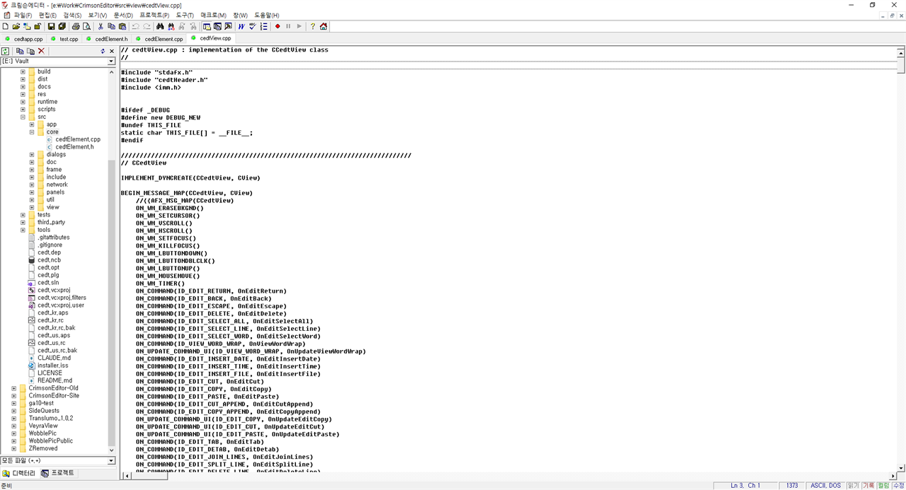

# Crimson Editor

A freeware source-code editor for Windows, originally written between 1999 and 2005 and modernized for 64-bit Windows in 2026.



---

## Download

The current release ships an x64 installer for Windows 10 and 11.

- **[Download cedt-381-setup.exe](https://github.com/igkang00/CrimsonEditor/releases/latest)** (≈ 26 MB) — from the GitHub Releases page

Run the installer and accept the UAC prompt. It installs to `Program Files\Crimson Editor`, bundles the Visual C++ x64 runtime, and optionally adds an "Edit with Crimson Editor" entry to the Explorer right-click menu.

> **Heads-up**: Crimson Editor stores all per-user state under `HKCU\Software\Crimson System\Crimson Editor` and `%APPDATA%\Crimson Editor\`. Uninstalling does **not** touch those, so reinstalling later picks back up where you left off.

---

## Features

- **Source-aware editing** — syntax highlighting for ~50 languages, configurable color schemes, word autocompletion from a dictionary
- **Multi-document interface (MDI)** — file tabs along the top, split views, drag-and-drop between tabs
- **Project workspace** — group related files and folders, switch between projects from the side panel
- **Find / Replace** — including regex and Find-in-Files across a folder tree
- **Integrated FTP** — open and save remote files directly, browse a remote tree
- **User-defined tools and macros** — wire external commands (compilers, formatters, scripts) into menus and shortcut keys, with output captured into a docked console
- **Korean / English editions** — both shipped in the single installer; pick at install time
- **Lightweight** — single executable, no managed runtime, < 2 MB Release binary

For the older feature documentation, see [docs/](docs/) and the bundled help in the install directory.

---

## Building from Source

Targets **Visual Studio 2026** (v145 toolset), MFC dynamic, x64.

```powershell
# Build all 4 configurations
msbuild cedt.sln /p:Configuration=Release-KR /p:Platform=x64
msbuild cedt.sln /p:Configuration=Release-US /p:Platform=x64
msbuild cedt.sln /p:Configuration=Debug-KR   /p:Platform=x64
msbuild cedt.sln /p:Configuration=Debug-US   /p:Platform=x64

# Or build the installer end-to-end (compiles binaries, downloads VC++ x64
# redist, runs Inno Setup):
.\scripts\build_installer.ps1
```

Build artifacts land in `build\x64\<Configuration>\` (e.g. `build\x64\Release-KR\cedt_kr.exe`); the installer lands in `dist\cedt-381-setup.exe`. Both `build\` and `dist\` are gitignored.

### Prerequisites

| | |
| --- | --- |
| **IDE** | Visual Studio 2026 (18.x) |
| **Toolset** | `v145` |
| **MFC component** | **C++ MFC for latest v145 build tools (x86 & x64)** — *not* part of the default VS install since VS 2017; add it from the **Individual components** tab. The MBCS libraries are bundled into this component on modern VS. |
| **Inno Setup 6** | only needed to build the installer — get it from <https://jrsoftware.org/isdl.php> |
| **vcpkg** | only needed to build/run the unit tests — `gtest` is declared as a manifest dependency in [tests/vcpkg.json](tests/vcpkg.json) |

The legacy VC6 build files (`.dsw` / `.dsp` / `.mak` / `.clw`) are preserved on the `cedt371-original` branch.

---

## Tests

```powershell
msbuild tests\cedt_tests.vcxproj /p:Configuration=Debug /p:Platform=x64
tests\build\x64\Debug\cedt_tests.exe
```

Current coverage: **60 tests across 12 suites, all green** — algorithm modules in `src/util/` (RegExp, evaluate, date, encode, PathName) and the MFC-data-container classes in `src/core/cedtElement.cpp` plus `src/util/SortStringArray`.

See [docs/testing.md](docs/testing.md) for the per-module test list, project settings, how to add a new test, and the planned roadmap for integration (L2) and end-to-end (L3) coverage.

---

## Project Structure

```
CrimsonEditor/
├── src/             # All cedt source: include / core / app / doc / view / frame /
│                    # panels / dialogs / network / util
├── tests/           # Google Test project (cedt_tests)
├── tools/           # launch.exe, ShellExt.dll — shipped with the installer
├── res/             # Icons, bitmaps, cursors, manifest
├── runtime/         # Files installed alongside cedt.exe (dictionaries, syntax specs,
│                    # color schemes, templates, docs)
├── scripts/         # Build automation (build_installer.ps1)
├── docs/            # Long-form design / behavior / refactoring notes
├── third_party/     # Bundled SDK headers (HtmlHelp.h)
├── cedt.sln, cedt.vcxproj    # Visual Studio 2026 build system
├── cedt_kr.rc, cedt_us.rc    # Resource files for KR / US editions
└── installer.iss             # Inno Setup installer script
```

For the full source breakdown — every `.cpp` and what it does, the MFC class diagram, and how shell integration is wired up — see **[docs/source-layout.md](docs/source-layout.md)**.

---

## Documentation

| | |
| --- | --- |
| [docs/source-layout.md](docs/source-layout.md) | Architecture overview, full source-file tour, shell integration internals |
| [docs/configuration.md](docs/configuration.md) | How settings are loaded at startup, where each piece of state lives, what happens on a clean first run |
| [docs/testing.md](docs/testing.md) | Test project layout, how to add a test, roadmap toward integration / E2E coverage |
| [docs/refactoring-memory-safety.md](docs/refactoring-memory-safety.md) | Memory-safety review with severities and a recommended fix order |
| [docs/refactoring-x64-migration.md](docs/refactoring-x64-migration.md) | Planning doc for the Win32 → x64 migration done in v3.81 |

---

## Roadmap

- [x] **VS 2026 migration** — `.dsp`/`.dsw` → `.vcxproj`/`.sln`, v145 toolset, MFC Dynamic + MBCS (originals preserved on `cedt371-original`)
- [x] **Source tree cleanup** — the previously flat ~180-file tree is now split into `src/{include,core,app,doc,view,frame,panels,dialogs,util,network}`
- [x] **64-bit migration** — shipped in v3.81
- [x] **Inno Setup installer** — replaces the legacy NSIS installer, bundles VC++ x64 redist
- [x] **Unit tests for the "medium" group** — `CSortStringArray`, `CMemText`, `CUndoBuffer`, `CKeywords`, `CDictionary`, `CLangSpec`, `CAnalyzedString`
- [ ] **Unicode build** — currently MBCS-only. The Korean IME handling ([cedtViewEditCompose.cpp](src/view/cedtViewEditCompose.cpp)) and `char`/`TCHAR` assumptions across the codebase need a pass
- [ ] **GitHub Actions CI** — automatically build the four configurations and run `cedt_tests` on every push
- [ ] **Integration tests (L2)** — exercise `CCedtDoc` and other CWinApp-dependent code without showing real windows. Requires extracting a `cedt_core` static library; see [docs/testing.md](docs/testing.md)
- [ ] **End-to-end UI tests (L3)** — drive `cedt_*.exe` through WinAppDriver / FlaUI / PyWinAuto / AutoHotkey

---

- **Version**: 3.81
- **Copyright**: © 1999–2026 Ingyu Kang
- **License**: see [LICENSE](LICENSE)
